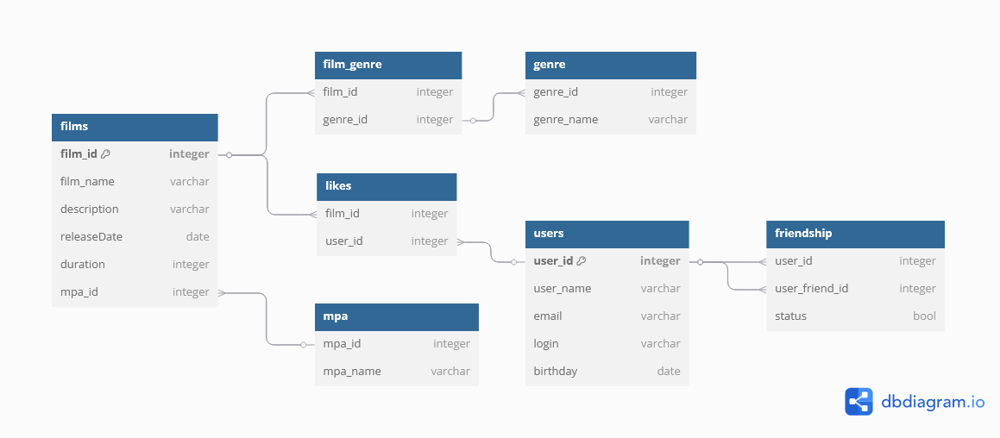

# Java-Filmorate

Java-Filmorate - это образовательный проект, созданный для разработки сервиса оценки фильмов.

## Структура базы данных

Сущности:

- films (фильмы)
- users (пользователи)
- genre (жанры)
- ratingMPA (рейтинг МПА)
- likes (лайки)
- friendship (друзья пользователей)

Описание:

База данных содержит информацию о фильмах и пользователях. У каждого фильма может быть несколько жанров, а также рейтинг МПА, 
определяющий возрастной ценз для фильма. Каждый пользователь может поставить лайк фильму и отправить запрос на добавление в друзья 
другому пользователю.

Статус для "дружеской" связи между пользователями:
- 1 - дружба есть
- 0 - дружбы нет

## ER-диаграмма
